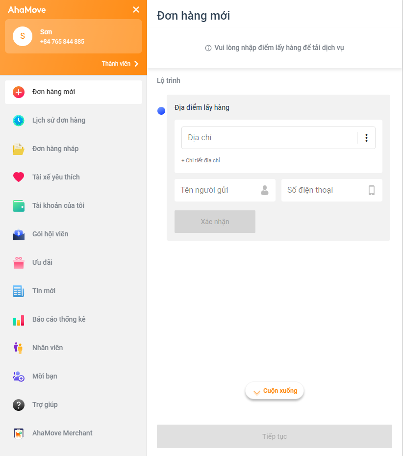

# Pros & Cons

# Ahamove have beatiful and unified UI. I can see this website base on linear-gradient color (106.41deg,#ffa242 -5.47%,#ff8302 129.9%) which is the same color as company's logo.

# There is input validations & dynamic instruction, i love these.

# But some, there still some things I think it's should improve.

# On the "Đơn hàng mới" section, I see there is one scroll down button. Since it has problem that's it's can't be hide if I change from Laptop L screen to Table screen.

  

# Also for "Đơn hàng mới" section, it's header is different from other. I think this make the UI ununified and a little confusing for user to use.

# And the last one I think is related to UX. Aha should divide app into 2 section, one is for the user logged in and one for user unlogged in. If I was the new member to Ahamove app and i'm not sure of all the services this app provided that I might not register account on it. At least, the app should show some additional information what services it provided to have a look on it.
